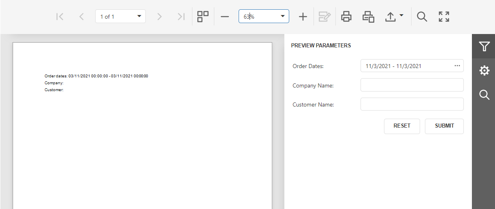
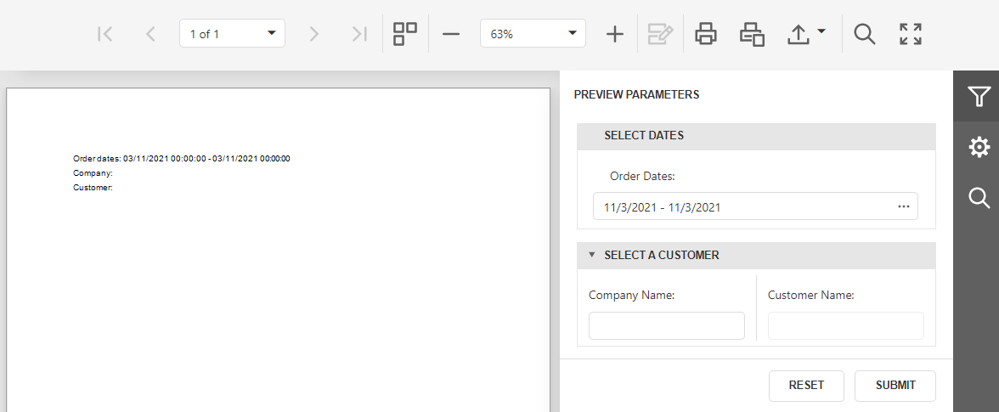

<!-- default badges list -->

[](https://docs.devexpress.com/GeneralInformation/403183)
<!-- default badges end -->
# Reporting for ASP.NET Core - Customize the Document Viewer Parameters Panel

This example uses the [ParameterPanelFluentBuilder](https://docs.devexpress.com/XtraReports/DevExpress.XtraReports.Parameters.ParameterPanelFluentBuilder) class to customize the [Document Viewer's](https://docs.devexpress.com/XtraReports/400248/web-reporting/asp-net-core-reporting/document-viewer-in-asp-net-core-applications) **Parameters** panel as follows:

1. Unite report parameters into groups and place parameters side-by-side.
2. Place a label and editor vertically for each parameter.
3. Add a separator between parameters inside a group.

| Default panel | Customized panel |
| :-: | :-: |
|  |  |


The `ParameterPanelFluentBuilder` accepts an instance of the `XtraReport` class. In your ASP.NET Core reporting application, register a [IReportProvider](https://docs.devexpress.com/XtraReports/DevExpress.XtraReports.Services.IReportProvider) service, create a report instance in the `GetReport` method and call `ParameterPanelFluentBuilder` over the report instance.
```
public class CustomReportProvider : IReportProvider {
        public XtraReport GetReport(string id, ReportProviderContext context)
        {
            if (id == "TestReport") {
                var report = new TestReport();
                ParameterPanelFluentBuilder.Begin(report)
                    .AddGroupItem(g0 => g0
                        .WithTitle("Select dates")
                        .AddParameterItem(report.Parameters[0], p0 => p0
                            .WithLabelOrientation(Orientation.Vertical)))
                    .AddGroupItem(g1 => g1
                        .WithTitle("Select a customer")
                        .WithOrientation(Orientation.Horizontal)
                        .WithShowExpandButton(true)
                        .AddParameterItem(report.Parameters[1], p1 => p1
                            .WithLabelOrientation(Orientation.Vertical))
                        .AddSeparatorItem()
                        .AddParameterItem(report.Parameters[2], p2 => p2
                            .WithLabelOrientation(Orientation.Vertical)))
                .End();

                report.Parameters["customer"].ExpressionBindings.Add(
                    new BasicExpressionBinding()
                    {
                        PropertyName = "Enabled",
                        Expression = "!IsNullOrEmpty(?company)",
                    }
                );
                return report;
            }
            return new XtraReport();
        }
}
```
The example also specifies an [expression](https://docs.devexpress.com/XtraReports/120091/detailed-guide-to-devexpress-reporting/use-expressions) for the [Enabled](https://docs.devexpress.com/CoreLibraries/DevExpress.XtraReports.Parameters.Parameter.Enabled) property to enable/disable a parameter's editor based on a value of another parameter.

<!-- default file list -->
## Files to Look At

- [CustomReportProvider.cs](./CS/Services/CustomReportProvider.cs#L17)

<!-- default file list end -->

## Documentation

- [ParameterPanelFluentBuilder Class](https://docs.devexpress.com/XtraReports/DevExpress.XtraReports.Parameters.ParameterPanelFluentBuilder)
- [The Parameters Panel](https://docs.devexpress.com/XtraReports/402960/detailed-guide-to-devexpress-reporting/use-report-parameters/parameters-panel)

